# HooRii Stage - Bespoke HomeAI, Built for Belonging

## 💡 What Is HooRii Stage?

**HooRii Stage** is an **open and modular hardware platform** designed to bring **HooRii AI** into the physical world.

It acts as a tangible **shell** for a single, persistent AI identity — providing the **display, voice, sensors, and physical presence** that allow an AI character to exist naturally in your home. 

Stage does not define the AI’s personality or memory — it **gives the AI a body**. 

This isn't just a **smarter home**.
It's a **home with a soul** — one you created.

---

## ✨ Core Features

### 💫 Emotionally Adaptive System

When hosted on Stage, **HooRii AI** gains a continuous physical presence. Through voice, visual feedback, and environmental awareness, interactions feel more natural and emotionally grounded — closer to engaging with a living presence than issuing commands to a device.

Powered by **HooRii AI**, the system integrates advanced multimodal technology with a **Self-Evolving Memory Engine**. This enables long-term, spatiotemporal memory, allowing the AI to remember your habits, preferences, and daily routines over time. Every interaction becomes a **growth moment**, refining how the AI understands you and responds.

As it learns, the AI gradually behaves like a thoughtful **“super butler”** — anticipating needs, adapting to patterns, and personalizing your home experience across devices. **HooRii Stage** enables these emotional and intelligent capabilities to manifest in the real world.

---

### 🏠 Redefining HomeAI: Beyond a Voice Assistant

Powered by smart IoT technology, you can control multiple smart home devices in one click through natural voice interaction — no manual operation required. It enables seamless interconnection across brands and protocols, making daily home life more efficient and hassle-free.

The AI character you create goes beyond a simple "voice assistant". Say something like “I’m so tired from work today”, and the AI can interpret intent and respond accordingly, such as adjusting lights or the indoor atmosphere to help you unwind.

> ▶️ Watch AI-driven device control in action

<table>
  <tr>
    <td align="center" width="50%">
      
       
      <b>AI-Driven Device Control Demo #1</b>
    </td>
    <td align="center" width="50%">
      
       
      <b>AI-Driven Device Control Demo #2</b>
    </td>
  </tr>
</table>

> ▶️ Watch the AI character follow your voice and turn to face you

> ▶️ Watch how the AI character reacts to its physical environment and responds to nearby events

<table width="100%">
  <tr>
    <td align="center" width="50%">
      
       
      <b>Environment-Aware AI Interaction Demo</b>
    </td>
    <td align="center" width="50%">
      
       
      <b>Motion Feedback Demo</b>
    </td>
  </tr>
</table>

---

### 🔄 One AI, Multiple Shells

AI characters can seamlessly transition **move between devices** — mobile apps, desktop environments, and HooRii Stage — while maintaining a **unified memory and identity**.

The AI exists on **only one device at a time**, “entering” and “exiting” different shells as needed. HooRii Stage is optimized to be the **always-on physical home** in this multi-device experience.

> ▶️ Watch the multi-device experience demo (app -> stage -> app -> desktop)

---

### 🌟 Workshop: One-Stop Creation of AI Agents

AI characters hosted on Stage are created and managed through **HooRii Workshop**, a platform that integrates key components such as **ASR**, **LLM**, **TTS**, and **AI-based image and video generation**, enabling **rapid role creation and deployment** without the need for complex configurations.

When creating an AI character, you can fully customize it or choose from preset "independent personality" roles that simulate human-like behavior.

- **Custom Mode** — Design every trait from scratch.
- **Platform Preset Mode** — Start with curated personalities.
- **Community Mode** — Explore and adopt creations shared by others.

> ▶️ Watch a step-by-step UX demo of AI character creation and interaction

---

## 🧩 Hardware Prototype

Below is an early **HooRii Stage hardware prototype**, illustrating the modular and extensible nature of the platform during development. The prototype integrates key components such as the compute module, display, camera, microphone and speakers, bringing AI characters into the physical world.

The images below show a more complete and assembled prototype, demonstrating how the hardware comes together as a standalone HomeAI device with an integrated display, enclosure, and I/O interfaces.

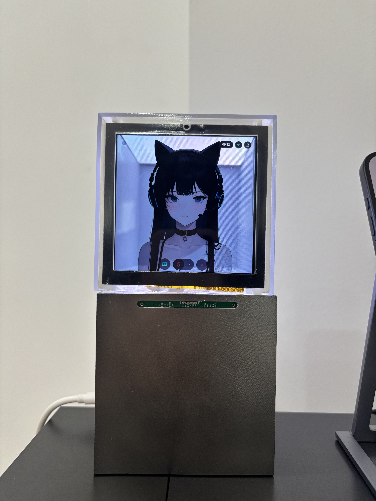

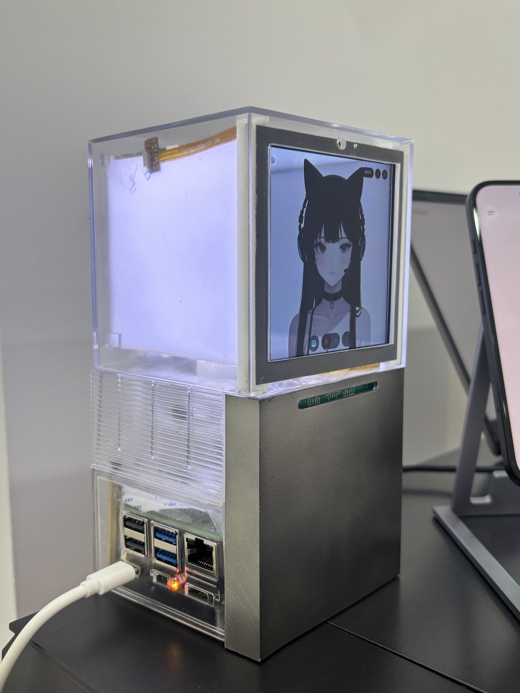

---

## PCB Revision Gallery

### Rev B01

<table width="100%">
  <tr>
    <td align="center" width="33%">
      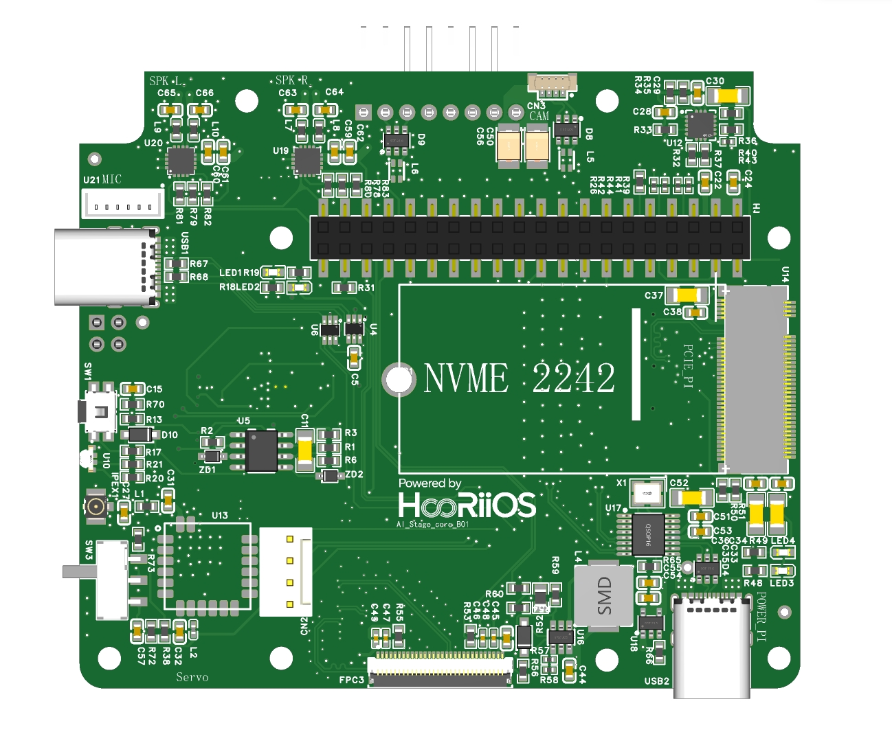
       
      <b>Top View</b>
    </td>
    <td align="center" width="33%">
      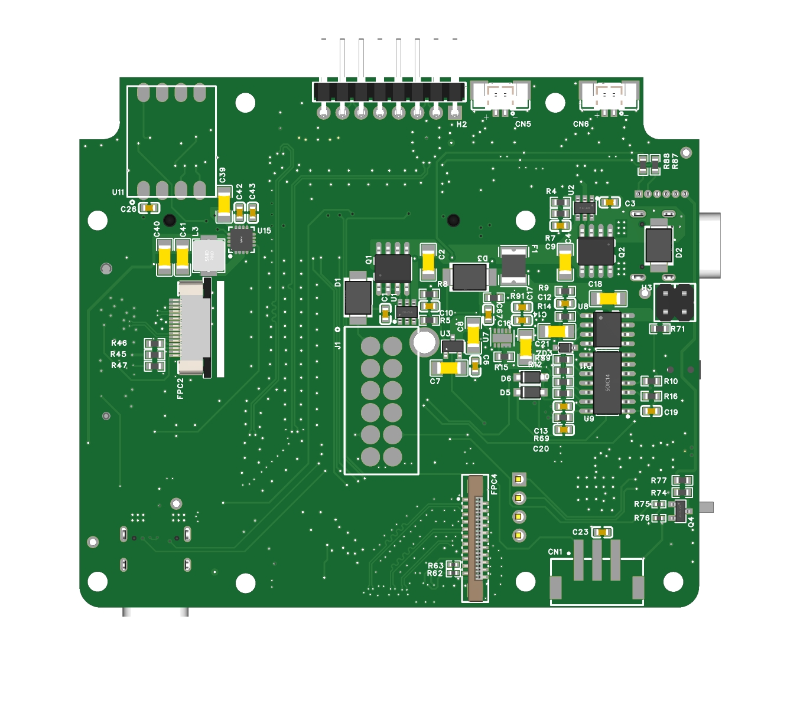
       
      <b>Bottom View</b>
    </td>
    <td align="center" width="33%">
      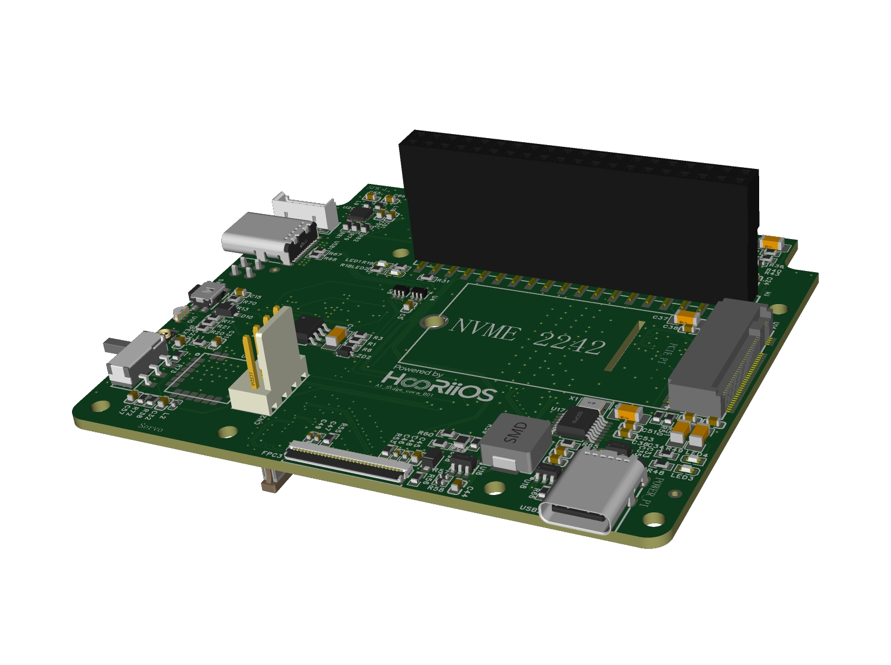
       
      <b>3D Render</b>
    </td>
  </tr>
</table>

### Rev B02

<table width="100%">
  <tr>
    <td align="center" width="33%">
      
       
      <b>Top View</b>
    </td>
    <td align="center" width="33%">
      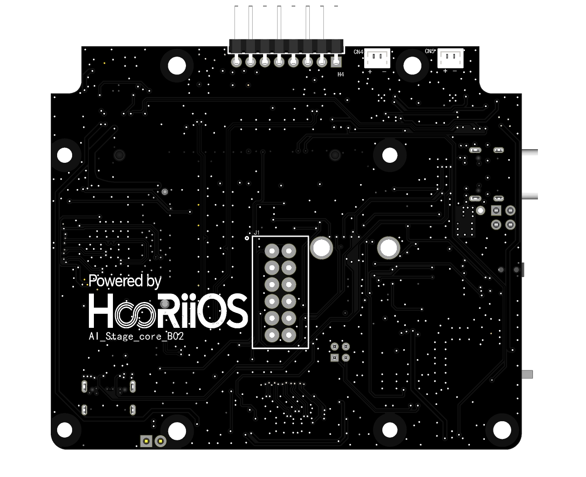
       
      <b>Bottom View</b>
    </td>
    <td align="center" width="33%">
      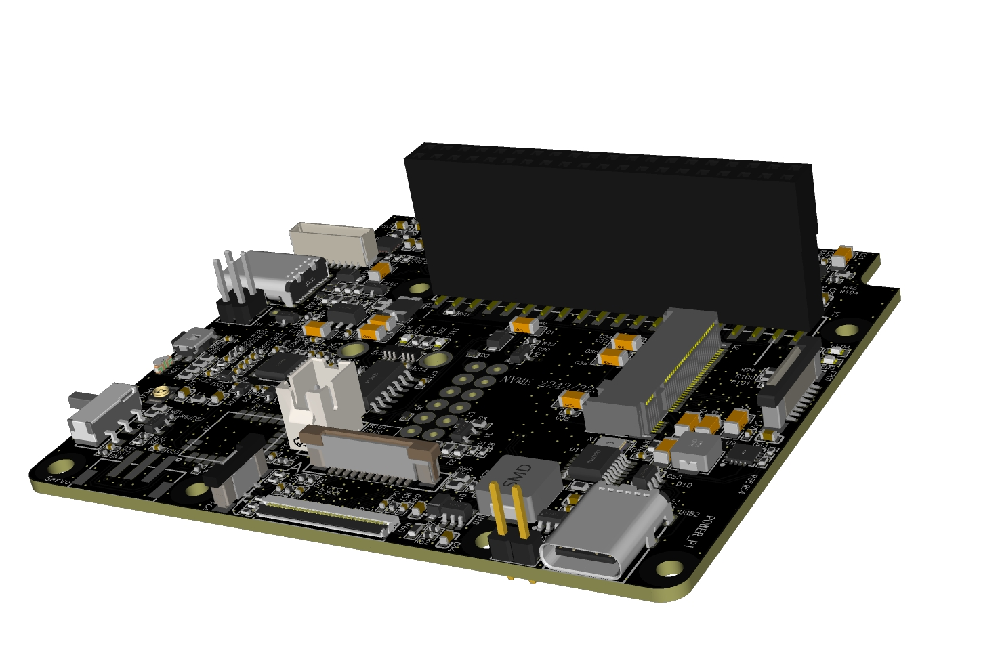
       
      <b>3D Render</b>
    </td>
  </tr>
</table>

### Rev B03

<table width="100%">
  <tr>
    <td align="center" width="33%">
      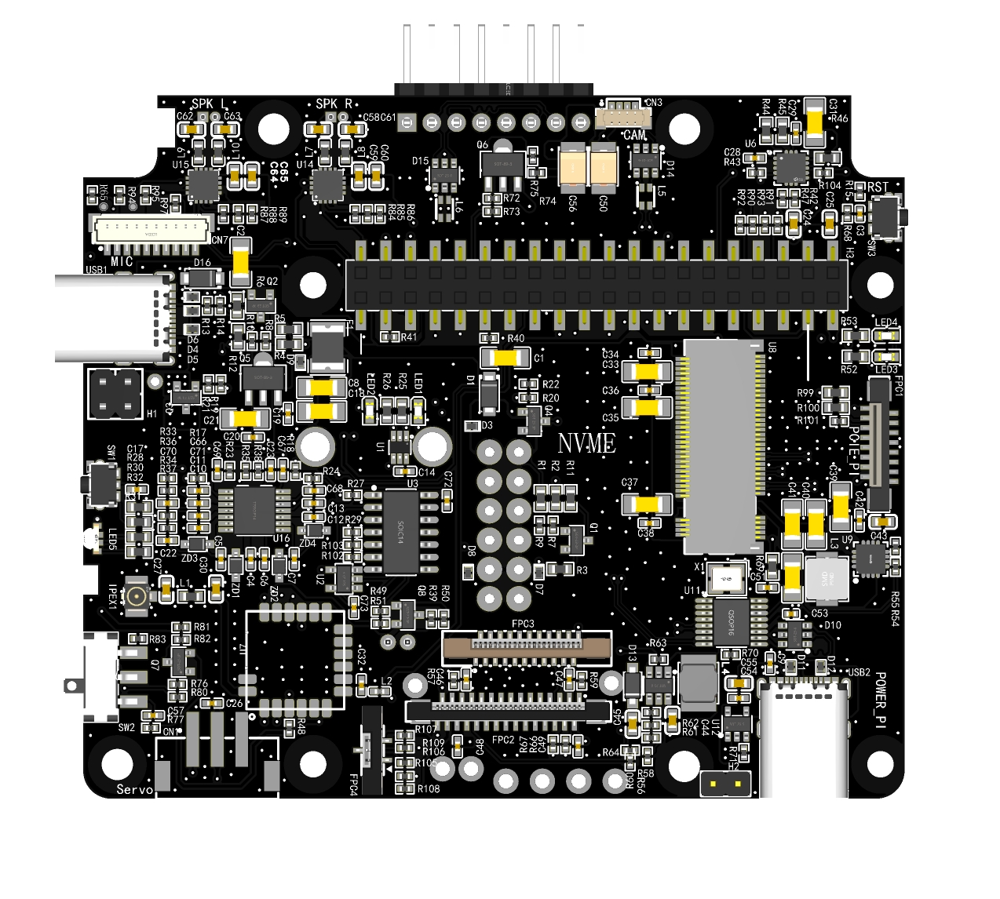
       
      <b>Top View</b>
    </td>
    <td align="center" width="33%">
      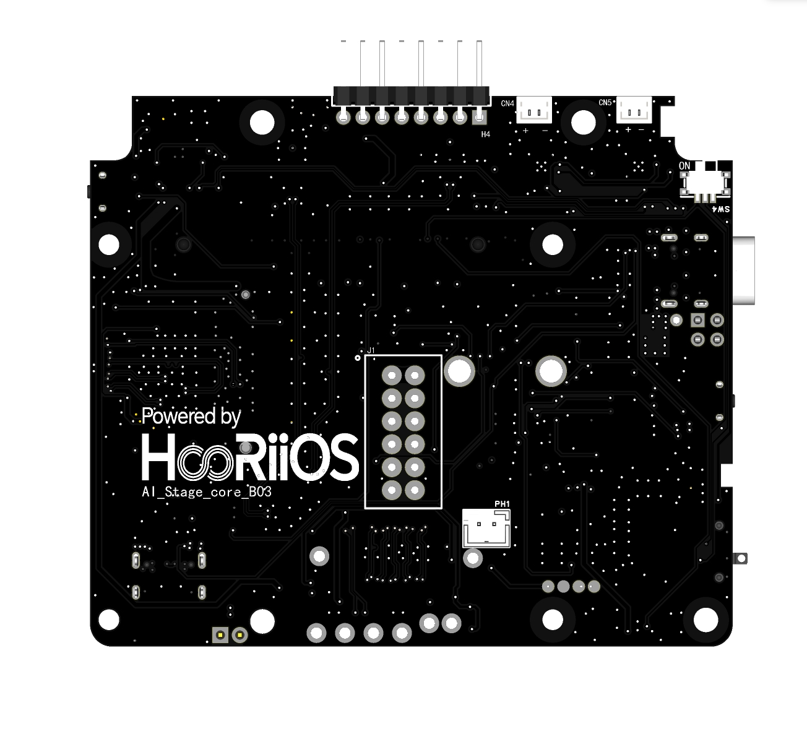
       
      <b>Bottom View</b>
    </td>
    <td align="center" width="33%">
      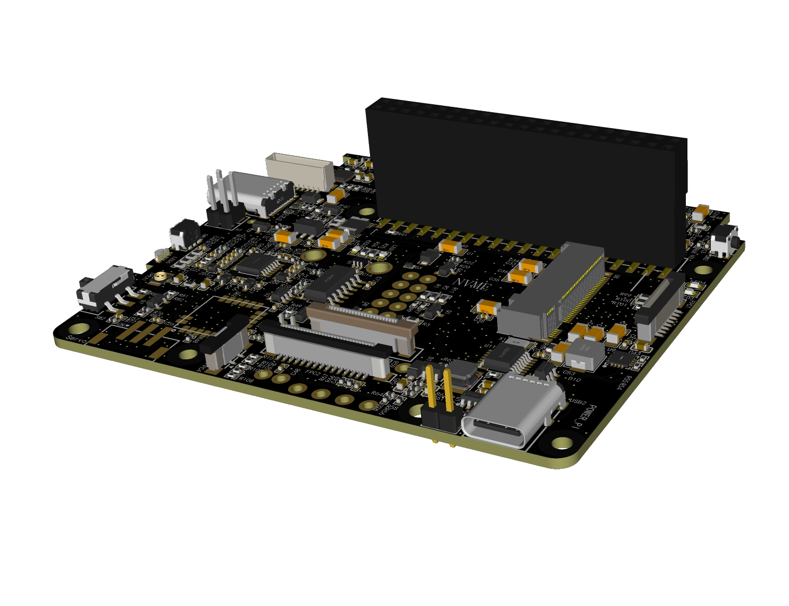
       
      <b>3D Render</b>
    </td>
  </tr>
</table>

## 🎪 CES 2026 Showcase

HooRii Stage made its debut at **CES 2026**, showcasing the future of HomeAI to the world. The images below capture the device in action at the exhibition, demonstrating its physical presence and interaction capabilities.

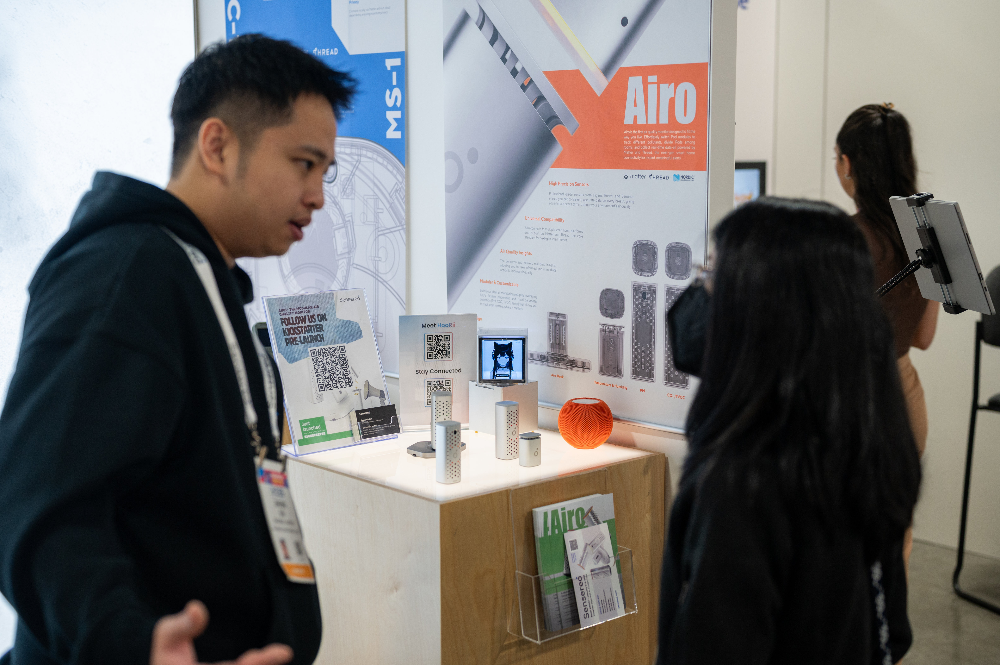

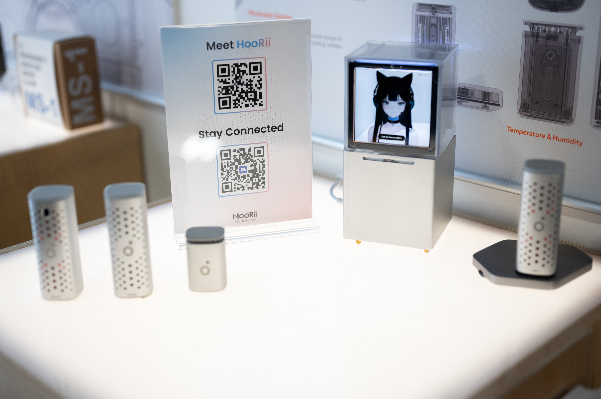

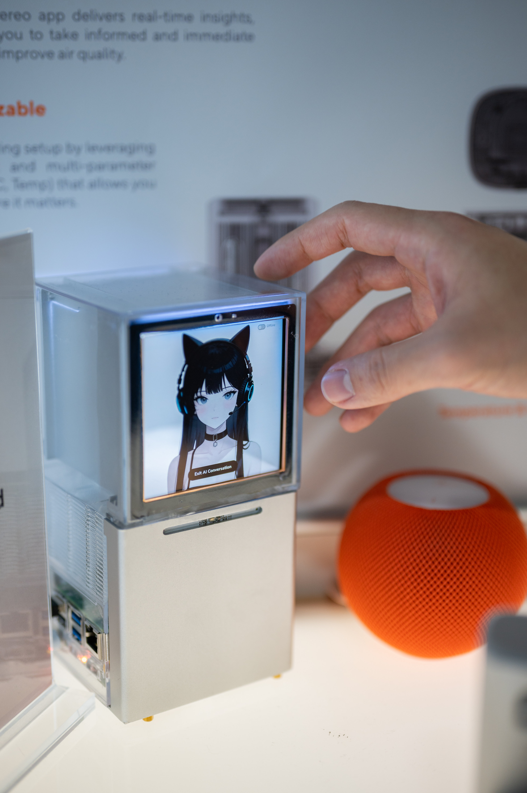

---

## 🚀 Join the Waitlist

Experience the future of belonging with AI.

👉 [https://www.hoorii.io/](https://www.hoorii.io/)
