# ClawStage - The Physical Body for OpenClaw Agents

## 💡 What Is ClawStage?

**ClawStage** is an **open and modular hardware platform** designed to allow OpenClaw to translate local intelligence into **physical behavior**.

It acts as a tangible **shell** for a single, persistent AI identity — providing the **display, voice, sensors, and physical presence** that allow an AI character to exist naturally in your home.

ClawStage does not define the AI’s personality or memory — it **gives the AI a body**.

This isn't just a **smarter home**.
It's a **home with a soul** — one you created.

  

  <b><a href="https://www.kickstarter.com/projects/hoorii/hoorii-stage-your-proactive-smart-personalized-companion-hub">Back us on Kickstarter →</a></b>

> ▶️ Watch the project overview: A Real AI Assistant is Here 🔥🔥

  <a href="https://youtu.be/l1qC7XyaCVc">
    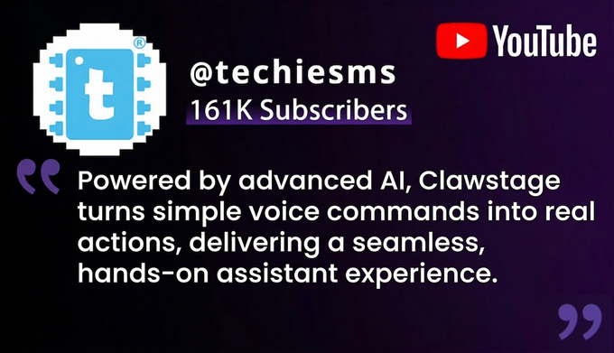
  </a>

> ▶️ Watch the project overview: From Chat to Claw: ClawStage Brings OpenClaw Into the Physical World

  <a href="https://youtu.be/uguVrMO3Ib8">
    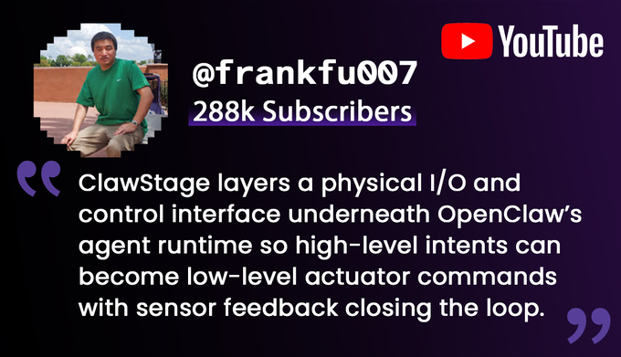
  </a>

---

## ✨ Core Features

### 💫 Emotionally Adaptive System

When hosted on Stage, **OpenClaw** gains a continuous physical presence. Through voice, visual feedback, and environmental awareness, interactions feel more natural and emotionally grounded — closer to engaging with a living presence than issuing commands to a device.

The system integrates advanced multimodal technology with a **Self-Evolving Memory Engine**. This enables long-term, spatiotemporal memory, allowing the AI to remember your habits, preferences, and daily routines over time. Every interaction becomes a **growth moment**, refining how the AI understands you and responds.

As it learns, the AI gradually behaves like a thoughtful **“super butler”** — anticipating needs, adapting to patterns, and personalizing your home experience across devices. **ClawStage** enables these emotional and intelligent capabilities to manifest in the real world.

---

### 🏠 Beyond a Voice Assistant

Powered by the built-in Home Assistant Hub in ClawStage, you can control multiple smart home devices through natural voice interaction — no manual operation required. It enables seamless interconnection across brands and protocols, making daily home life more efficient and hassle-free.

The AI character you create goes beyond a simple "voice assistant". Say something like “I’m so tired from work today”, and the AI can interpret intent and respond accordingly, such as adjusting lights or the indoor atmosphere to help you unwind.

> ▶️ Watch AI-driven device control in action

<table>
  <tr>
    <td align="center" width="50%">
      
       
      <b>AI-Driven Device Control Demo #1</b>
    </td>
    <td align="center" width="50%">
      
       
      <b>AI-Driven Device Control Demo #2</b>
    </td>
  </tr>
</table>

> ▶️ Watch the AI character follow your voice and turn to face you

> ▶️ Watch how the AI character reacts to its physical environment and responds to nearby events

<table width="100%">
  <tr>
    <td align="center" width="50%">
      
       
      <b>Environment-Aware AI Interaction Demo</b>
    </td>
    <td align="center" width="50%">
      
       
      <b>Motion Feedback Demo</b>
    </td>
  </tr>
</table>

---

### 🔄 One AI, Multiple Shells

AI characters can seamlessly **move between devices** — mobile apps, desktop environments, and ClawStage — while maintaining a **unified memory and identity**.

The AI exists on **only one device at a time**, “entering” and “exiting” different shells as needed. ClawStage is optimized to be the **always-on physical home** in this multi-device experience.

> ▶️ Watch the multi-device experience demo (app -> stage -> app -> desktop)

---

### 🌟 Workshop: One-Stop Creation of AI Agents

AI characters hosted on ClawStage are created and managed through **HooRii Workshop**, a platform that integrates key components such as **ASR**, **LLM**, **TTS**, and **AI-based image and video generation**, enabling **rapid role creation and deployment** without complex configurations.

When creating an AI character, you can fully customize it or choose from preset "independent personality" roles that simulate human-like behavior.

- **Custom Mode** — Design every trait from scratch.
- **Platform Preset Mode** — Start with curated personalities.
- **Community Mode** — Explore and adopt creations shared by others.

> ▶️ Watch a step-by-step UX demo of AI character creation and interaction

---

## 📋 Technical Specifications

High-level hardware summary for ClawStage. _Specifications may change with product revisions; see the **PCB Revision Gallery** section below for board-specific updates._

| Feature                | Description                                                              |
| :--------------------- | :----------------------------------------------------------------------- |
| **Product Dimensions** | Enclosure 92 × 92 × 184 mm (L × W × H).                                  |
| **Processing Unit**    | Raspberry Pi 5 with 8 GB RAM.                                            |
| **Display**            | 3.95" capacitive touchscreen, 720 × 720 resolution, 800 nits brightness. |
| **Microphone**         | Dual-microphone array, 65 dB(A) signal-to-noise ratio (SNR).             |
| **Speaker**            | Integrated 3 W mono speaker.                                             |
| **Servo**              | Operational rotation angle 5° to 175°.                                   |
| **Sensors**            | 3-axis MEMS accelerometer and ambient light sensor.                      |
| **Camera**             | 1920 × 1080 (1080p), 83.9° field of view (FoV).                          |
| **Storage**            | 32 GB microSD (included); M.2 NVMe, 2230 / 2242 form factors supported.  |
| **Cooling**            | Raspberry Pi 5 compatible bundled cooling fan.                           |
| **Privacy Control**    | Hardware switch to enable or disable microphone and camera.              |
| **Power**              | USB Power Delivery (USB-PD) compatible power supply.                     |

---

## 🧩 Hardware Prototype

Below is an early **ClawStage hardware prototype**, illustrating the modular and extensible nature of the platform during development. The prototype integrates key components such as the compute module, display, camera, microphone array, and speakers, bringing AI characters into the physical world.

The images below show a more complete and assembled prototype, demonstrating how the hardware comes together as a standalone HomeAI device with an integrated display, enclosure, and I/O interfaces.

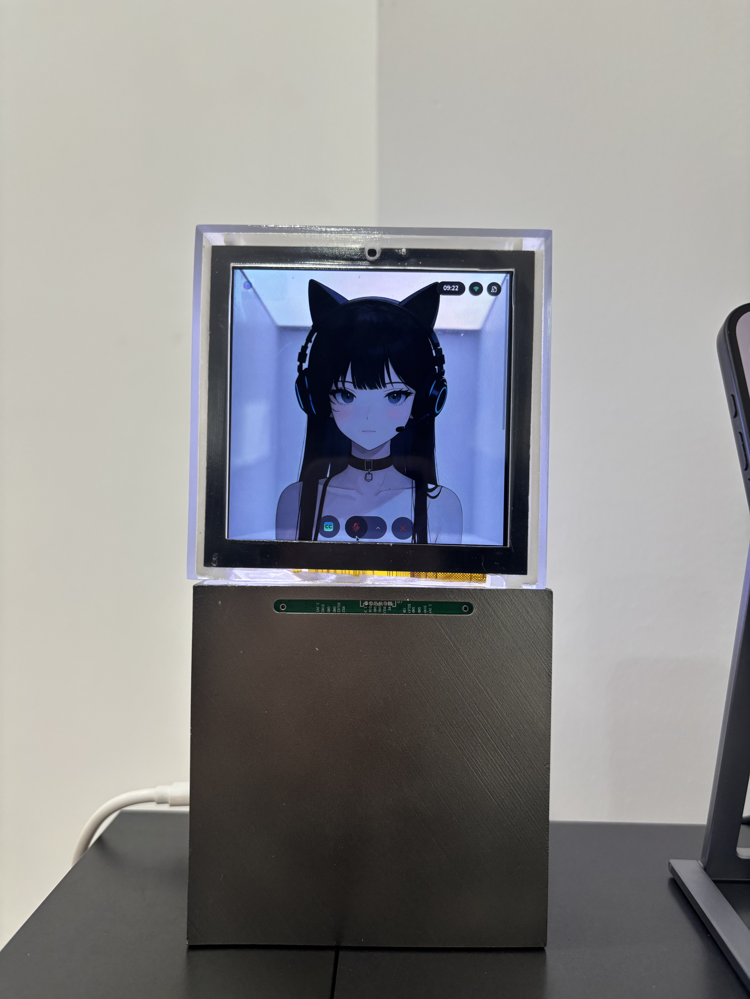

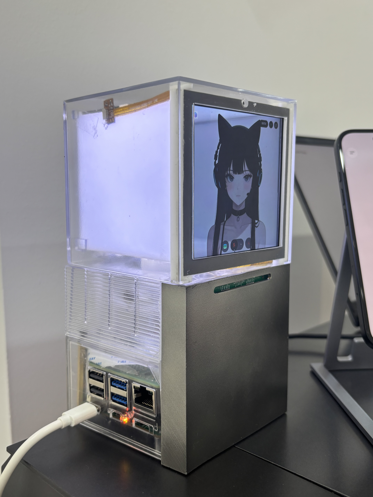

---

## 🧠 PCB Revision Gallery

### Rev B01 (11/18/2025)

<table width="100%">
  <tr>
    <td align="center" width="33%">
      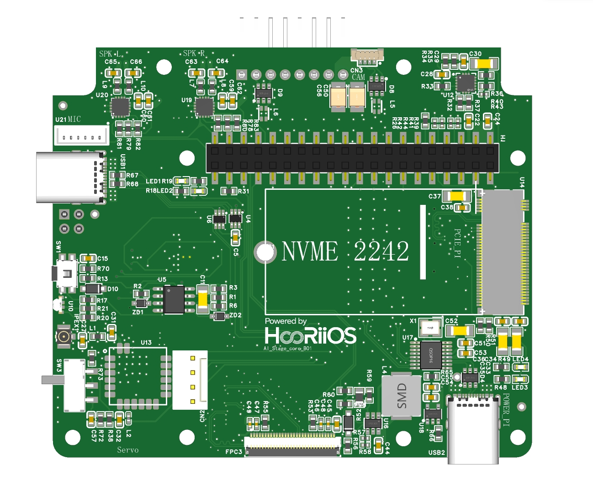
       
      <b>Top View</b>
    </td>
    <td align="center" width="33%">
      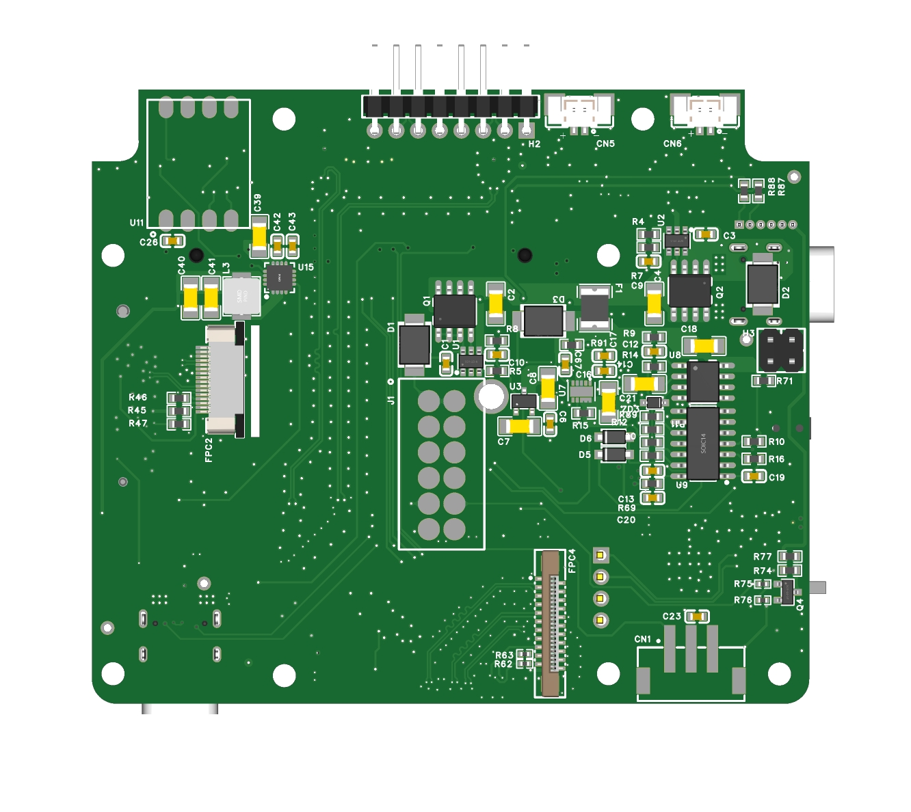
       
      <b>Bottom View</b>
    </td>
    <td align="center" width="33%">
      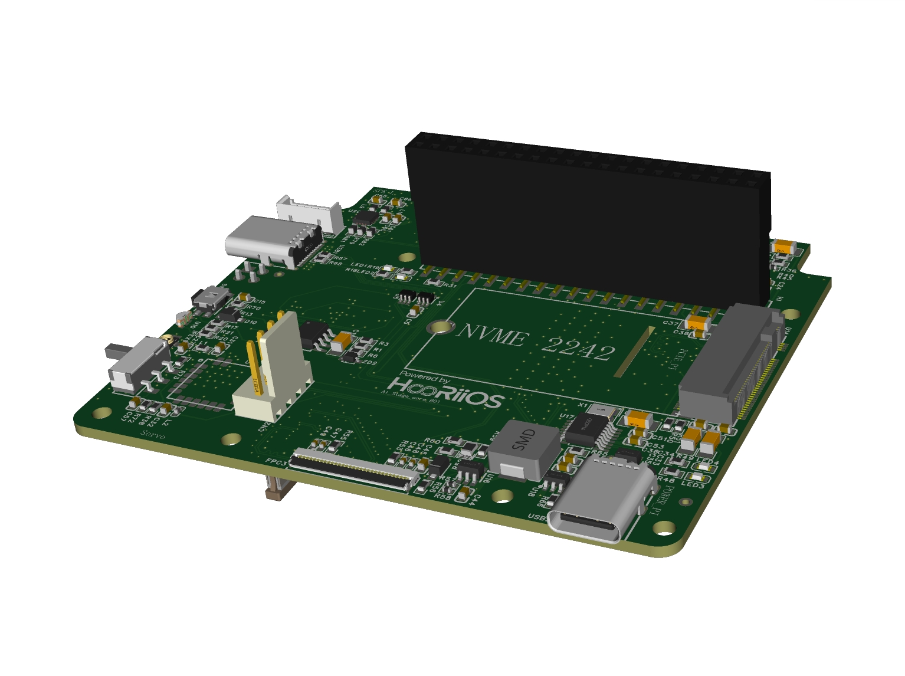
       
      <b>3D Render</b>
    </td>
  </tr>
</table>

**Overview**

Rev B01 is the first fully integrated core PCB for **ClawStage**.  
It establishes the baseline hardware architecture and validates the complete system design, including storage, power, and expansion interfaces.

### Rev B02 (12/17/2025)

<table width="100%">
  <tr>
    <td align="center" width="33%">
      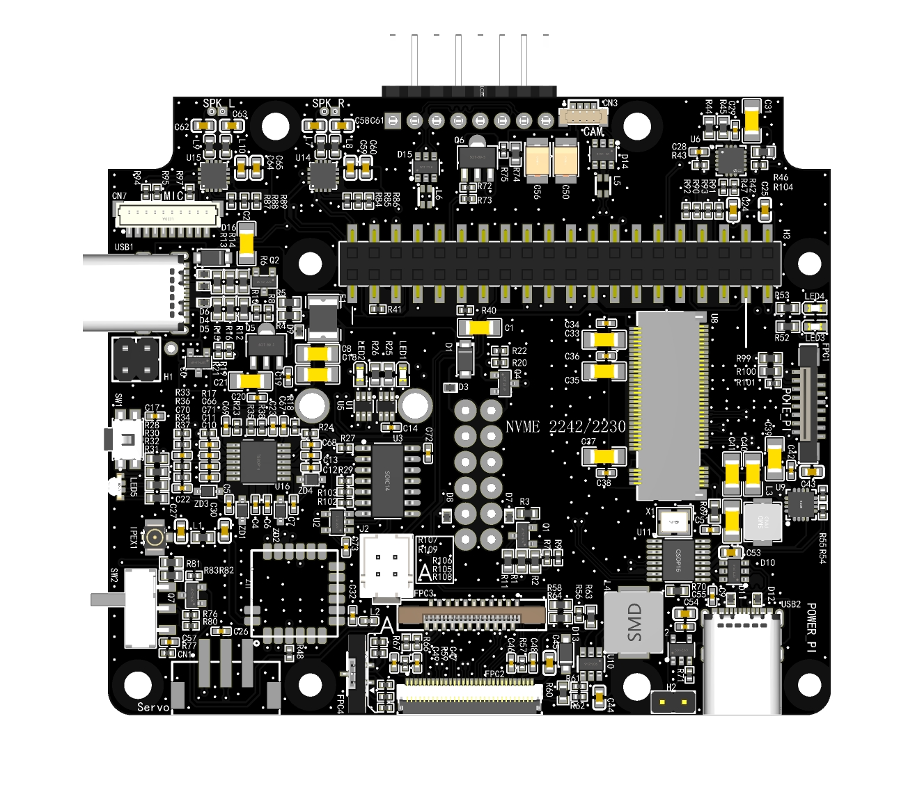
       
      <b>Top View</b>
    </td>
    <td align="center" width="33%">
      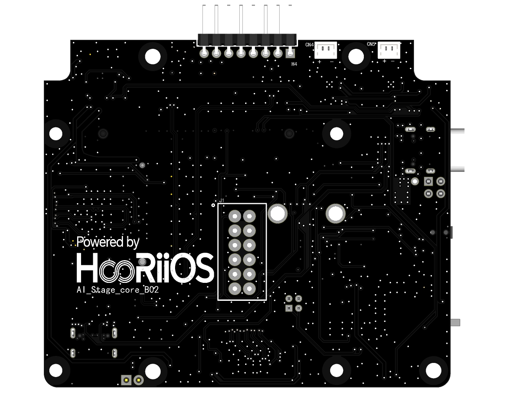
       
      <b>Bottom View</b>
    </td>
    <td align="center" width="33%">
      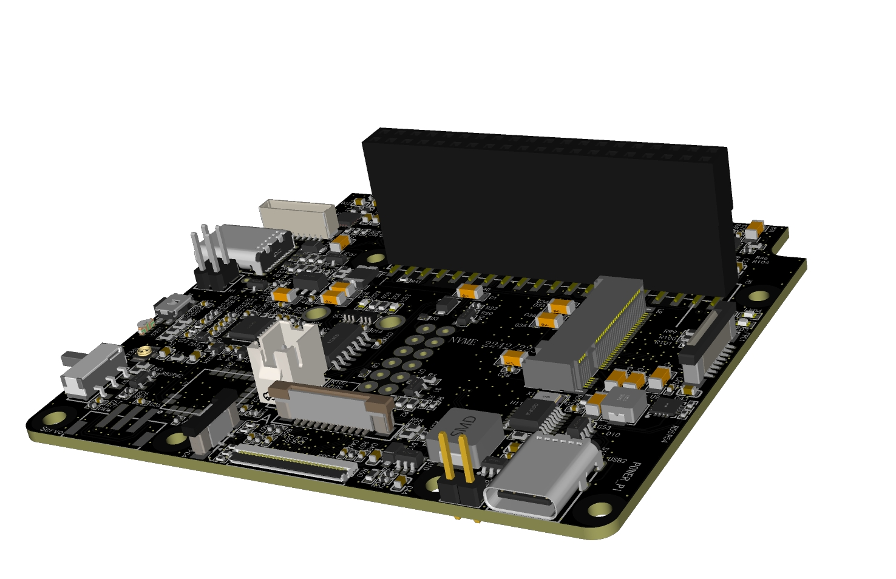
       
      <b>3D Render</b>
    </td>
  </tr>
</table>

**Changes from Rev B01**

- Simplified PCB layout by transitioning from a dual-sided design to a single-sided design
- Added interface support for an ambient light sensor
- Updated NVMe SSD support to include both M.2 2230 and 2242 form factors
- Reworked the power button to use Raspberry Pi native power control interface
- Enhanced the privacy switch to control both the microphone and camera simultaneously (previously microphone only)

### Rev B03 (1/22/2026)

<table width="100%">
  <tr>
    <td align="center" width="33%">
      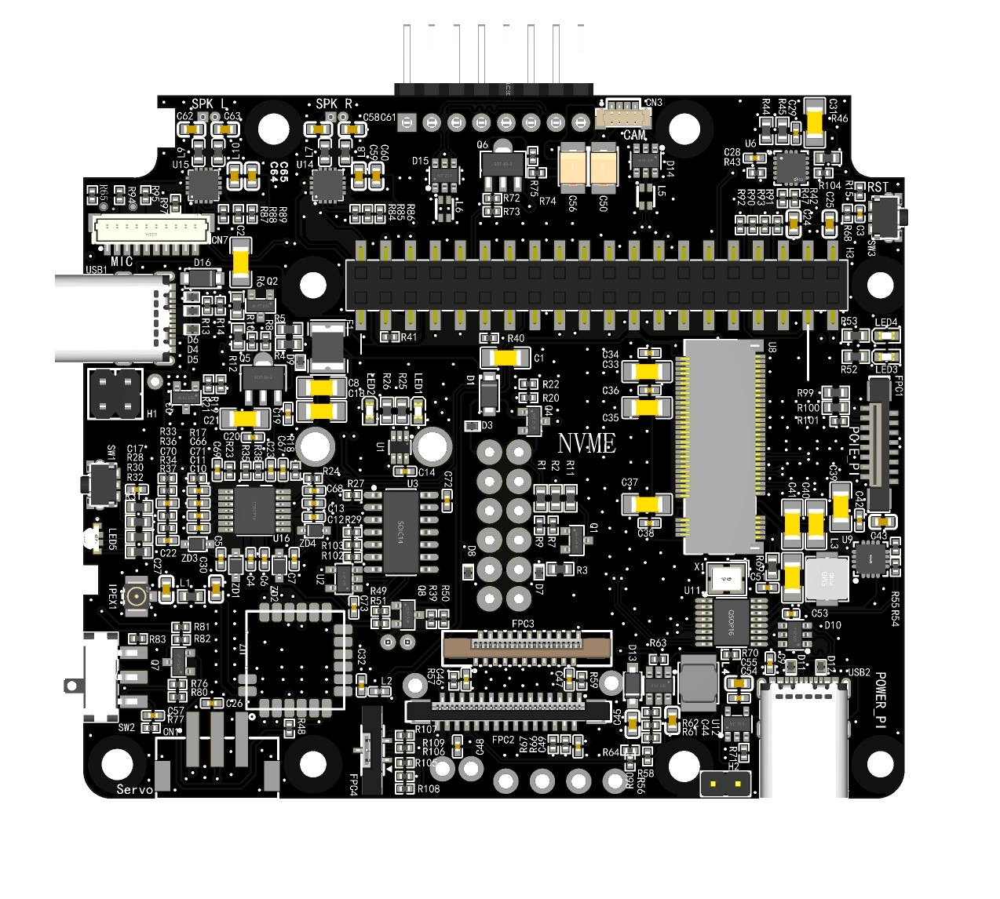
       
      <b>Top View</b>
    </td>
    <td align="center" width="33%">
      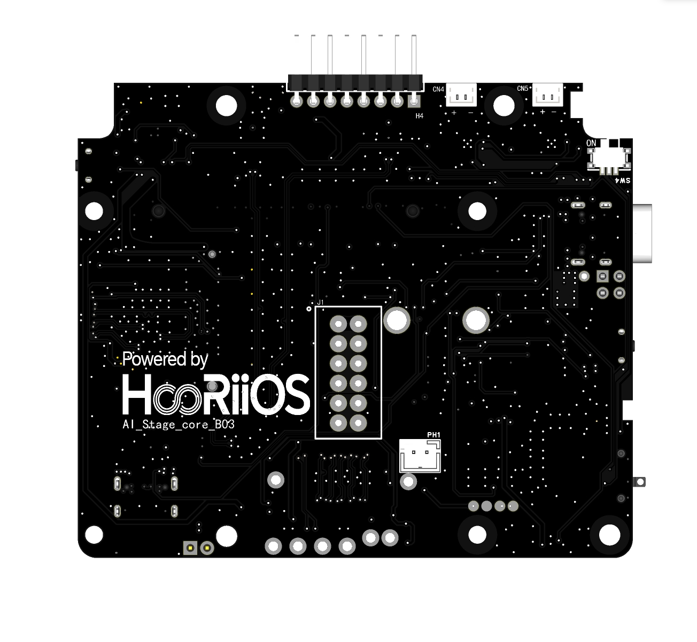
       
      <b>Bottom View</b>
    </td>
    <td align="center" width="33%">
      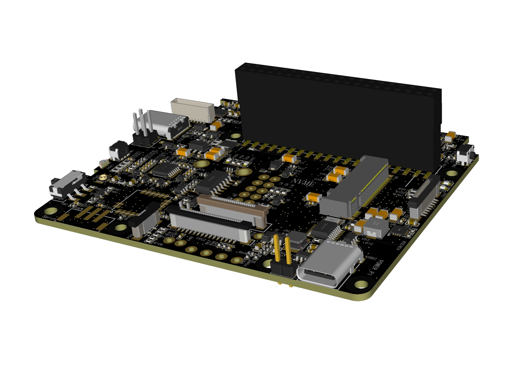
       
      <b>3D Render</b>
    </td>
  </tr>
</table>

**Changes from Rev B02**

- Added a dedicated microphone power selection switch; when enabled, microphone power is no longer controlled by the privacy switch
- Added a hardware factory reset button
- Introduced a fan connector and additional ventilation openings for improved thermal management
- Optimized connector placement and overall interface layout
- Fine-tuned audio circuit parameters for improved performance

---

## 🚀 Join the Waitlist

Experience the future of belonging with AI.

👉 [https://clawstage.ai/](https://clawstage.ai/)
